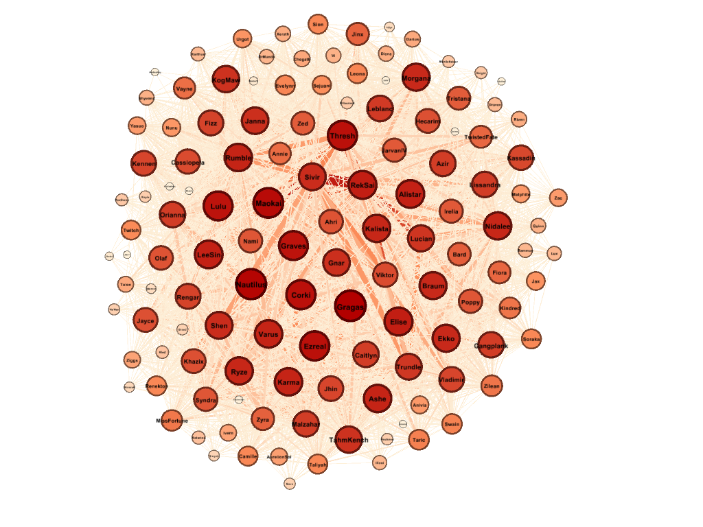
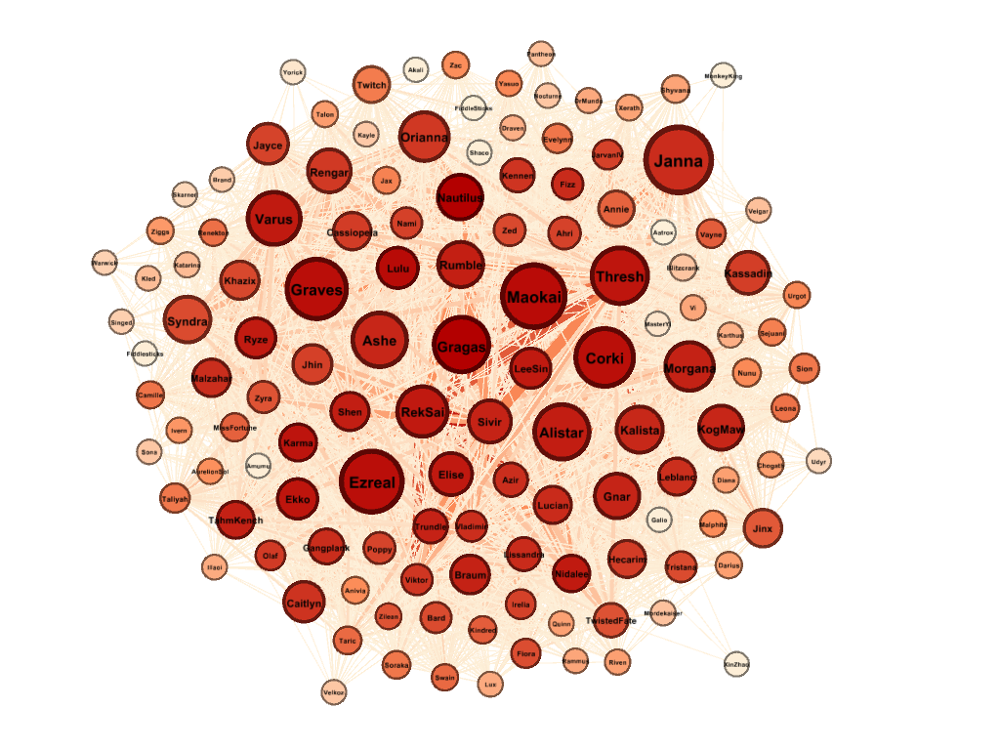
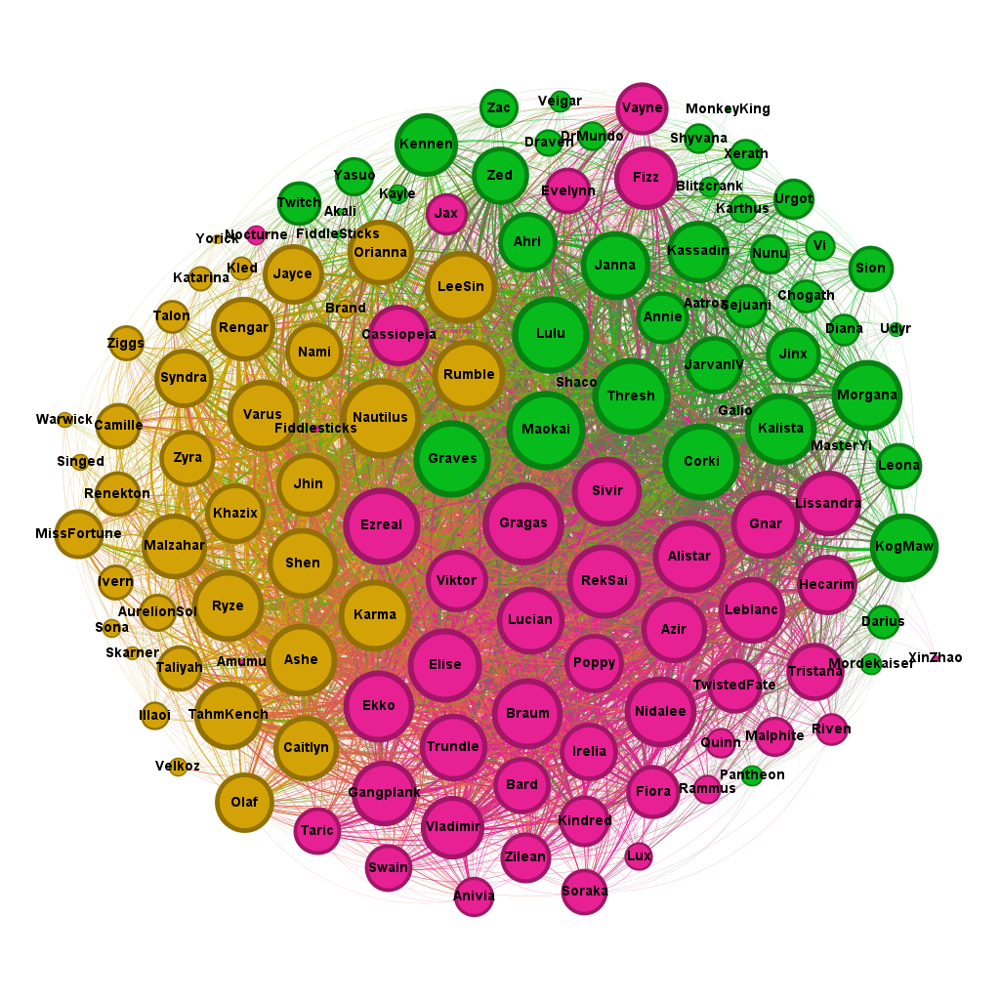
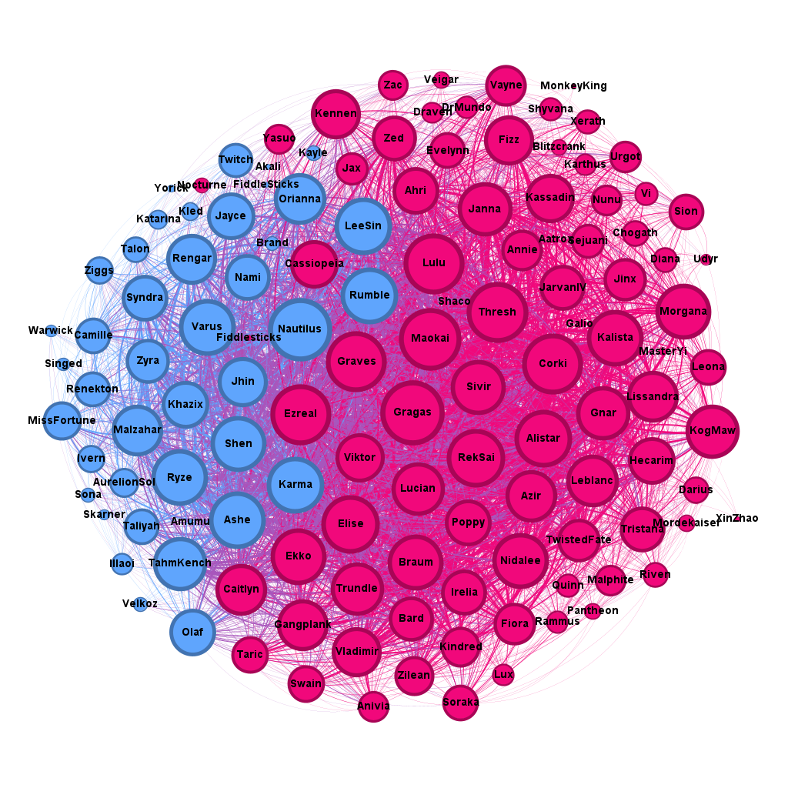

# League of Legends Competitive Synergy Network Analysis (2015-2017)

## Project Overview
This project presents a comprehensive Social Network Analysis (SNA) of competitive synergies in **League of Legends** during the 2015-2017 period. Using a dataset of champion co-occurrences in winning professional teams, we modeled a non-directed graph to identify influential actors and tactical community structures.

The analysis was performed using **Gephi 0.10.1**, applying metrics of centrality and community detection algorithms (Louvain and Leiden).

---

## 1. Global Network Properties
The network consists of **129 nodes** (champions) and **3,777 edges** (winning synergies). The graph is characterized by extreme cohesion and "small-world" properties.

| Metric | Value |
| :--- | :--- |
| Density | 0.457 |
| Average Degree | 58.558 |
| Average Path Length | 1.553 |
| Diameter | 3 |
| Avg. Clustering Coefficient | 0.749 |

**Tactical Insight:** A density of 0.457 indicates that nearly 46% of all possible synergies resulted in professional victories. The low diameter (3) proves that the competitive meta was highly interconnected, with most champions being only one or two "links" away from each other.

> *Figure 1: Global network visualization using Force Atlas 2. Node size represents Degree.*

---

## 2. Centrality Analysis (Key Players)
We identified the most influential champions based on four key metrics:

*   **Versatility Kings (Degree & Closeness):** **Gragas** and **Nautilus** lead these categories. They were the ultimate "Flex Picks," fitting into almost any team composition without revealing the final strategy.
*   **Tactical Bridges (Betweenness):** **Janna** holds the highest betweenness. She acted as a structural bridge, connecting different damage sources with various frontlines that would otherwise be incompatible.
*   **Force Multipliers (Eigenvector):** **Lulu** stands out here. While she has fewer total connections than tanks, her synergies are linked to the most successful champions in the meta, maximizing the team's power ceiling.
*   **Pillars of Consistency:** **Maokai** and **Ezreal** maintained top-5 positions across all metrics, representing low-risk, high-reward "must-master" champions.

> *Figure 2: Multi-dimensional centrality visualization. Node size: Betweenness; Color: Eigenvector.*

---

## 3. Community Detection & Tactical Roles
We compared two modularity-based methods to understand how champions clustered into tactical families.

### Louvain Method (Res: 1.0 | Q: 0.108)
Divided the network into 3 balanced tactical pillars:
*   **Community 0 (Versatility):** Nautilus, Karma, Lee Sin. Safe draft picks and utility.
*   **Community 1 (Protection):** Maokai, Janna, Lulu. Focused on "Protect the ADC" and hard-engage.
*   **Community 2 (Mobility):** Gragas, Elise, Ezreal. Defined by high rotation potential and map pressure.

> ****

### Leiden Method (Res: 0.8 | Q: 0.205)
Optimized the structure into 2 macro-ecosystems:
*   **Cluster 0 (Generalist Meta):** The core competitive standard (87 nodes). Champions that win regardless of a specific niche strategy.
*   **Cluster 1 (Strategic Utility):** Tactical response group (42 nodes). Focused on long-range utility and objective control to counter the raw power of Cluster 0.

> ****

**Conclusion:** The low overall modularity confirms that the professional meta-game was fluid. Champions were not isolated in silos; rather, the meta revolved around a "power core" balanced by a "strategic utility block."

---

## Tools Used
*   **Gephi:** Network visualization and metric calculation.
*   **Force Atlas 2:** Spatial layout algorithm.
*   **Louvain & Leiden Algorithms:** Community detection.

---
**Author:** Miguel Quiroga Campos
